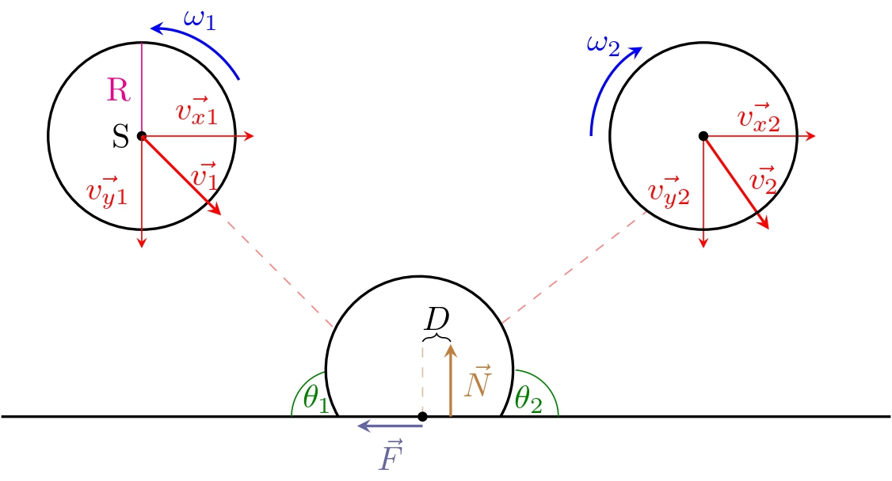

# Rocnikovka2023-2024
Repo na sdílení dílčích pokroků pro moji ročníkovou práci
Obsahuje jednu složku na samotnou práci a druhou na simulátor.
Hlavním smyslem je simulovat míček co s nenulovou úhlovou rychlostí dopadá na povrch a od něj se odráží. Určit směr, kterým se odrazí a další vlastnosti odrazu.

# Diagram

# Preciznější popis:

Jaký jev pozorujeme:
Například u stolního tenisu si můžeme všimnout jednoho zajímavého jevu. Když má
míček nenulovou úhlovou rychlost může se stát, že po odrazu se jeho rychlost po
x-ové souřadnici obrátí. Nemusí mít stále stejnou velikost, ale její směr se
obrátí -> začne se vracet.

Cílem této práce je popsat jaké veličiny hrají roli v tom jestli se míček
odrazí nebo ne. Vzhledem k tomu, že úhlová rychlost je charakteristická pro
tento jev rád bych tedy vyjádřil výsledek jako:
pro tuto úhlovou rychlost musí mít míček také
-takovou rychlost
-takovýto úhel dopadu
-takovýto koeficient tření mezi ním a povrchem na který dopadá
Tedy ten fakt jestli se odrazí nebo ne formuloval jako funkci úhlové rychlosti.

Moje výzkumná metoda bude naprogramování simulátoru, který mi pomůže ověřit
mojí hypotézu. Rovnice popisující tento děj jsou odvozené z obecných kinematických. Ty jsem převzal z odborných článků.

# Co bude příště?
Příprava na předobhajobu:
- [x] Popsat případ jen se smýkáním
- [x] Dokončit prezentaci

Kroky pro dokončení celé práce:
- [ ] Popsat pro jaké spiny je model jen se smýkáním validní
- [ ] Rozšířit model i na rolování
- [ ] Sám si odvodit rovnice
- [ ] Alespoň teoreticky se podívat na problém do větší hloubky
 
